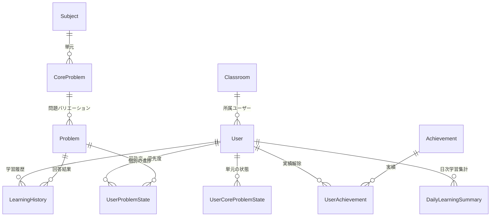

# Architecture Documentation

このドキュメントは、本プロジェクト「Sullivan」の技術アーキテクチャ、ディレクトリ構造、および主要なデータフローについて解説します。

## 1. プロジェクト概要
**Sullivan** は、Next.js (App Router) をベースとした学習管理システム（LMS）です。
生徒の学習進捗管理、AIを活用した自動採点・フィードバック、忘却曲線に基づく復習優先度の計算、
および個別最適化された教材のプリント出力機能を核としています。

## 2. 技術スタック

### Frontend / Application Framework
* **Framework**: [Next.js 16](https://nextjs.org/) (App Router)
* **Language**: TypeScript
* **Styling**:
    * [Tailwind CSS v4](https://tailwindcss.com/)
    * [shadcn/ui](https://ui.shadcn.com/) (Radix UIベースのコンポーネント集)
* **Animation**: Framer Motion
* **Charts**: Recharts
* **State/Form**: React Hook Form + Zod

### Backend / Database
* **Runtime**: Node.js (Next.js Server Actions / API Routes)
* **Database**: PostgreSQL
* **ORM**: [Prisma](https://www.prisma.io/)
* **Authentication**: Supabase Auth (SSR)
    * `middleware.ts` によるルート保護とセッション更新
    * 役割情報は `app_metadata` を参照

### External Services / AI
* **AI Model**: Google Gemini API (`@google/generative-ai`)
    * 用途: 解答内容の読み取り、採点、フィードバック生成
* **Storage / Ingestion**: Google Drive API
    * Push Notification (Webhook) で採点対象ファイルを検知
* **Background Jobs**: Upstash QStash
    * Drive検知後の採点処理をキューイング
* **State Store**: Upstash Redis
    * Drive Watch状態の保存

## 3. ディレクトリ構造 (`src/`)

```
src/
├── app/                 # Next.js App Router ページ・ルーティング
│   ├── (auth)/          # 認証関連ページ（ログインなど）
│   ├── admin/           # 管理者ダッシュボード・機能
│   ├── teacher/         # 講師用ダッシュボード・機能
│   ├── dashboard/       # 生徒用ダッシュボード
│   ├── api/             # API Routes
│   └── actions.ts       # Server Actions (データ操作のエントリーポイント)
│
├── components/          # UIコンポーネント
│   ├── ui/              # shadcn/ui 基本コンポーネント
│   └── ...              # 機能別コンポーネント
│
├── lib/                 # コアビジネスロジック・ユーティリティ
│   ├── auth.ts          # セッション取得ヘルパ
│   ├── grading-service.ts # Drive取込/採点/DB更新
│   ├── print-algo.ts    # 出題選定ロジック
│   ├── progression.ts   # アンロック判定ロジック
│   ├── drive-client.ts  # Google Drive API クライアント
│   ├── drive-webhook-manager.ts # Drive Watch 登録/停止
│   ├── drive-watch-state.ts     # Watch状態の保存 (Upstash Redis)
│   ├── supabase/        # Supabase SSRクライアント
│   └── utils.ts         # 汎用ユーティリティ
│
└── middleware.ts        # 認証ガード
```

## 4. データモデル (Prisma Schema)

主要なエンティティの関係性は以下の通りです。



* **Subject / CoreProblem / Problem**:
    * 教材の階層構造。`Problem` が出題の最小単位。
* **User**:
    * `Role` (STUDENT, TEACHER, PARENT, ADMIN) により権限を分離。
* **LearningHistory**:
    * 評価 (A-D) とフィードバックを含む解答ログ。
* **UserProblemState**:
    * `priority` と `lastAnsweredAt` を保持。
    * 忘却度計算に `lastAnsweredAt` を使用。
* **UserCoreProblemState**:
    * 単元の優先度とアンロック状態を保持。
    * 出題選定とアンロック判定に利用。
* **Achievement / UserAchievement**:
    * 実績の定義と解除状況を管理。
* **DailyLearningSummary**:
    * 日次の学習数を集計（ヒートマップ/連続学習に使用）。
* **User.metadata**:
    * スタンプカードなど軽量なユーザー状態を保持。

## 5. 主要なロジックフロー

### 5.1. AI採点と進捗更新フロー
1. **Drive検知**: `/api/grading/webhook` がDriveのPush通知を受信。
2. **ジョブ発行**: 新規ファイルを抽出し、QStashへキューイング（未設定時は同期処理）。
3. **ファイル処理**: `/api/queue/grading` がファイルを `/tmp` にダウンロード。
4. **QR解析**:
    * 画像ファイルはPython + OpenCVでQR解析。
    * 失敗時やPDFはGeminiでフォールバック。
5. **採点**: Geminiが解答を読み取り、評価(A-D)と日本語フィードバックを生成。
6. **保存/更新**:
    * `LearningHistory` を保存。
    * `UserProblemState` と `UserCoreProblemState` を更新。
7. **アンロック判定**: `checkProgressAndUnlock` で次のCoreProblemを解放。
8. **ゲーミフィケーション更新**: XP/連続学習/実績を更新。
9. **通知**: SSEイベント `grading_completed` を発火（必要に応じて `gamification_update` も送出）。

### 5.2. プリント生成フロー
1. **問題選択**: 教師が対象生徒と教科を選択。
2. **出題選定**: `lib/print-algo.ts` が解放済み範囲から問題を選出。
3. **レイアウト**: `print-layout.tsx` がA4用紙へページネーション。
4. **解答用紙**: 最終ページに解答欄とQRコードを配置。

### 5.3. Drive Watch 管理
* **初回登録**: `/api/drive/watch/setup` を手動実行。
* **更新**: `/api/drive/watch/renew` を12時間ごとに実行（Cloud Scheduler推奨）。
* **状態保存**: `drive-watch-state.ts` でUpstash Redisへ保存。

## 6. 開発ガイドライン

### 環境構築
```bash
# 依存関係インストール
npm install

# データベース起動・マイグレーション
npx prisma migrate dev
npx prisma db seed

# 開発サーバー起動
npm run dev
```

### データベース管理
* **GUIツール**: `npx prisma studio` でデータを直接閲覧・編集可能。
* **スキーマ変更**: `prisma/schema.prisma` を編集後、`npx prisma db push` で反映。

### デプロイメント
* **Build**: `npm run build`
* **Environment Variables**: `.env` とデプロイ先に以下が必要。
    * `DATABASE_URL`, `DIRECT_URL`
    * `NEXT_PUBLIC_SUPABASE_URL`, `NEXT_PUBLIC_SUPABASE_ANON_KEY`, `SUPABASE_SERVICE_ROLE_KEY`
    * `GEMINI_API_KEY`, `DRIVE_FOLDER_ID`, `APP_URL`
    * `QSTASH_TOKEN` (必要に応じて `QSTASH_CURRENT_SIGNING_KEY`, `QSTASH_NEXT_SIGNING_KEY`)
    * `UPSTASH_REDIS_REST_URL`, `UPSTASH_REDIS_REST_TOKEN`
    * `INTERNAL_API_SECRET` (任意), `DRIVE_WEBHOOK_CHANNEL_ID` (任意)
