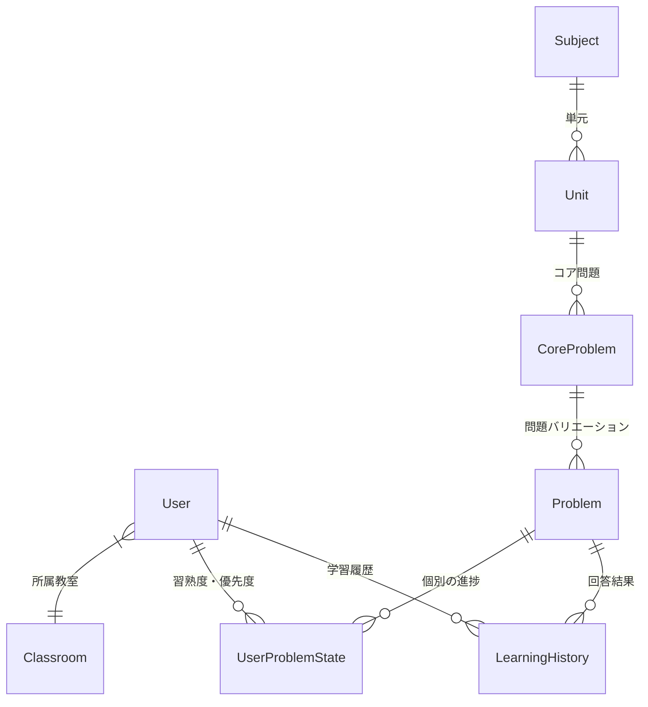

# Architecture Documentation

このドキュメントは、本プロジェクト「Sullivan」の技術アーキテクチャ、ディレクトリ構造、および主要なデータフローについて解説します。

## 1. プロジェクト概要
**Sullivan** は、Next.js (App Router) をベースとした学習管理システム（LMS）です。
生徒の学習進捗管理、AIを活用した自動採点・フィードバック、忘却曲線理論に基づいた復習優先度の自動計算、および個別最適化された教材のプリント出力機能を核としています。

## 2. 技術スタック

### Frontend / Application Framework
*   **Framework**: [Next.js 16](https://nextjs.org/) (App Router)
*   **Language**: TypeScript
*   **Styling**: 
    *   [Tailwind CSS v4](https://tailwindcss.com/)
    *   [shadcn/ui](https://ui.shadcn.com/) (Radix UIベースのコンポーネント集)
*   **Animation**: Framer Motion
*   **Charts**: Recharts
*   **State/Form**: React Hook Form + Zod

### Backend / Database
*   **Runtime**: Node.js (Next.js Server Actions / API Routes)
*   **Database**: PostgreSQL
*   **ORM**: [Prisma](https://www.prisma.io/)
*   **Authentication**: Custom JWT implementation (`jose`, `bcryptjs`)
    *   `middleware.ts` によるルート保護とセッション管理

### External Services / AI
*   **AI Model**: Google Gemini API (`@google/generative-ai`)
    *   用途: 記述式回答の自動採点、解説生成、学習アドバイス

## 3. ディレクトリ構造 (`src/`)

```
src/
├── app/                 # Next.js App Router ページ・ルーティング
│   ├── (auth)/          # 認証関連ページ（ログインなど）
│   ├── teacher/         # 講師用ダッシュボード・機能
│   ├── student/         # 生徒用学習画面
│   ├── api/             # API Routes (必要に応じて)
│   └── actions.ts       # Server Actions (データ操作のエントリーポイント)
│
├── components/          # UIコンポーネント
│   ├── ui/              # shadcn/ui 基本コンポーネント (Button, Input等)
│   └── ...              # 機能別コンポーネント
│
├── lib/                 # コアビジネスロジック・ユーティリティ
│   ├── auth.ts          # 認証・トークン管理・Cookie操作
│   ├── gemini.ts        # Gemini API クライアント・プロンプト定義
│   ├── prisma.ts        # Prisma Client シングルトン
│   ├── priority-algo.ts # 復習優先度計算アルゴリズム (Space Repetition)
│   ├── print-algo.ts    # プリントレイアウト計算・ページネーションロジック
│   └── utils.ts         # 汎用ユーティリティ (cn関数など)
│
└── middleware.ts        # エッジミドルウェア (認証ガード)
```

## 4. データモデル (Prisma Schema)

主要なエンティティの関係性は以下の通りです。



*   **Subject / Unit / CoreProblem / Problem**:
    *   教材の階層構造。`Problem` が実際に出題される最小単位。
*   **User**:
    *   `Role` (STUDENT, TEACHER, PARENT, ADMIN) により権限を分離。
*   **LearningHistory**:
    *   「いつ」「誰が」「どの問題を」「どう答えたか」のログ。
    *   AIによる評価 (A-D) とフィードバックテキストを含む。
*   **UserProblemState**:
    *   各問題に対するユーザーの現在の習熟度。
    *   `priority` (優先度スコア) を持ち、これが高いほど次回の学習で出題されやすくなる。

## 5. 主要なロジックフロー

### 5.1. AI採点と優先度更新フロー
1.  **回答送信**: 生徒がUIから回答を送信 (Server Action)。
2.  **AI採点**: `lib/gemini.ts` が回答と正解を比較し、評価(A-D)と解説を生成。
3.  **履歴保存**: `LearningHistory` に結果を保存。
4.  **優先度計算**: `lib/priority-algo.ts` が過去の履歴と忘却曲線を元に、新しい `priority` を計算。
5.  **状態更新**: `UserProblemState` を更新。次回学習時に優先度の高い問題が抽出される。

### 5.2. プリント生成フロー (`lib/print-algo.ts`)
1.  **問題選択**: 教師が対象生徒と単元を選択。
2.  **レイアウト計算**:
    *   選択された問題を解析し、A4用紙（通常2ページ）に収まるようにページネーションを計算。
    *   問題文の長さや改行を考慮し、動的に高さを調整。
3.  **レンダリング**:
    *   印刷用CSS (`@media print`) を適用したページを表示。
    *   3ページ目には解答記入欄専用のレイアウトを生成。

## 6. 開発ガイドライン

### 環境構築
```bash
# 依存関係インストール
npm install

# データベース起動・マイグレーション
npx prisma generate
npx prisma db push

# 開発サーバー起動
npm run dev
```

### データベース管理
*   **GUIツール**: `npx prisma studio` でデータを直接閲覧・編集可能。
*   **スキーマ変更**: `prisma/schema.prisma` を編集後、`npx prisma db push` で反映。

### デプロイメント
*   **Build**: `npm run build`
*   **Environment Variables**: `.env` ファイルおよびデプロイ先の設定で `DATABASE_URL`, `GEMINI_API_KEY`, `JWT_SECRET` 等が必須。
