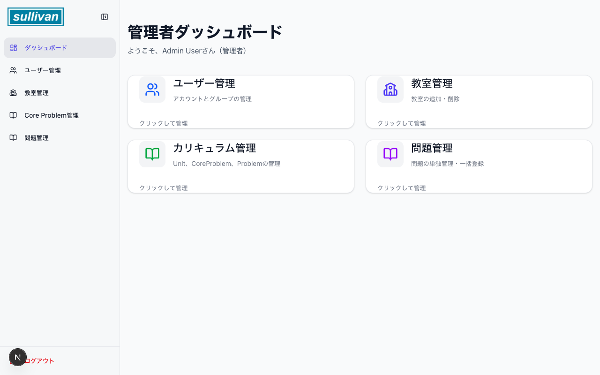
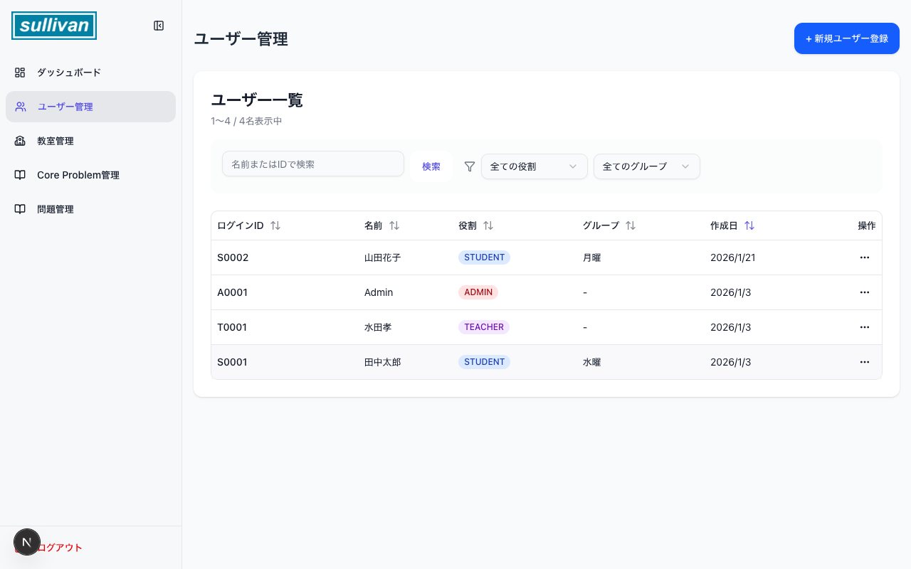
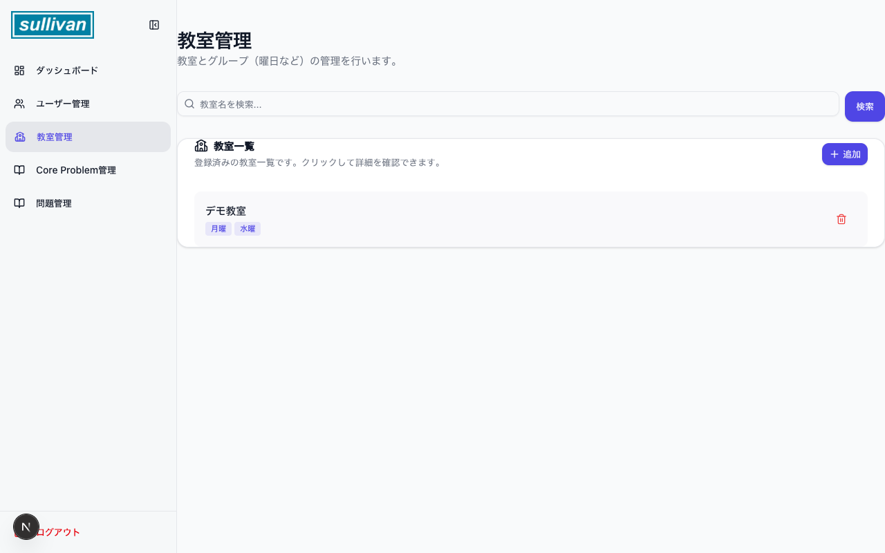
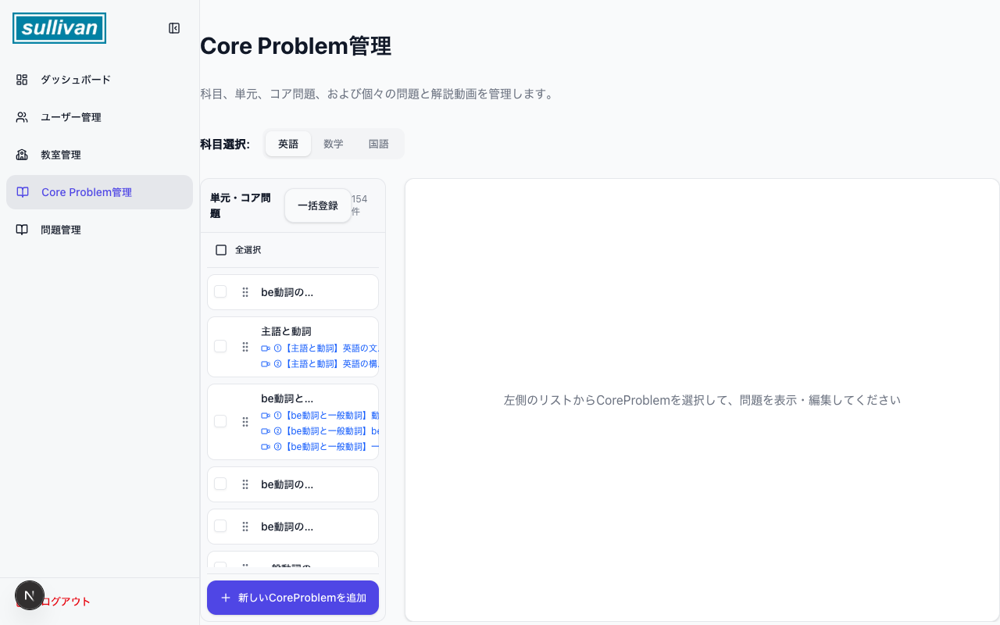
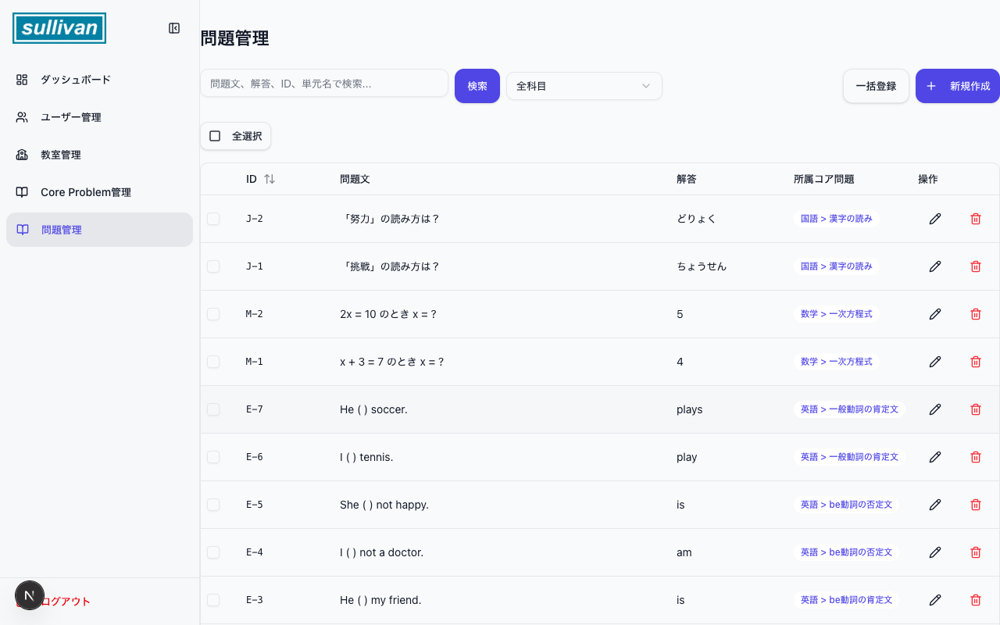
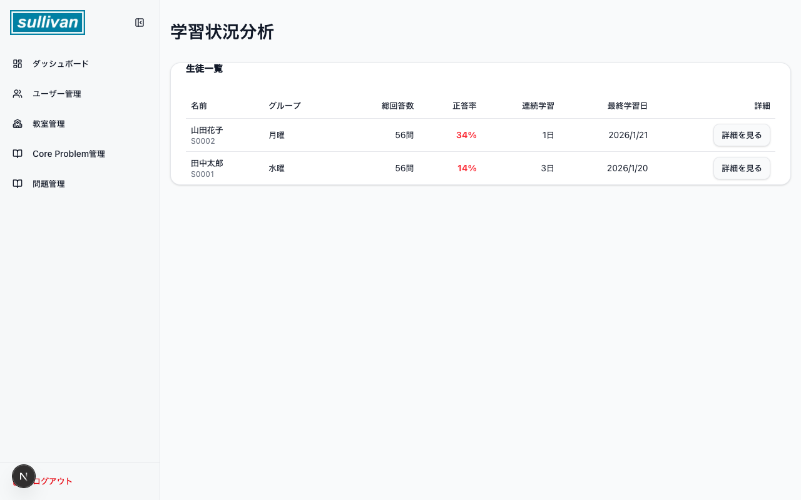

# 管理者マニュアル 構成案

本ドキュメントは、Sullivan Learning 管理者（Admin）向けの操作マニュアルの構成案および内容です。
各スライドに対応するスクリーンショットを添付しています。

## スライド1: 表紙
- タイトル: Sullivan Learning 管理者マニュアル
- 日付: 2026年1月25日
- 対象: システム管理者

## スライド2: 管理者機能の概要
管理者アカウント（Admin）では、以下の機能を利用して学習プラットフォーム全体の管理を行います。

- **ユーザー管理**: 生徒・講師・管理者のアカウント作成・編集・削除
- **クラスルーム管理**: クラスの作成、生徒・講師の割り当て
- **カリキュラム管理**: 学習カリキュラムの作成と配信設定
- **問題管理**: 演習問題のデータベース管理
- **アナリティクス**: 学習進捗や利用状況の分析

---

## スライド3: ログイン
管理者アカウントでログインします。

- **URL**: `/login` (またはトップページからログイン)
- **ID**: `A0001` (初期管理者ID)
- **Password**: `password`

_(ログイン画面のスクリーンショットは省略、または必要に応じて追加)_

---

## スライド4: ダッシュボード
ログイン直後に表示される画面です。システムの概要を確認できます。

**添付スクリーンショット**: `01_dashboard.png`

- **確認項目**:
    - 総ユーザー数
    - アクティブなクラス数
    - 最近のアクティビティ

---

## スライド5: ユーザー管理
システムを利用する全ユーザー（生徒、講師、管理者）を一元管理します。

**添付スクリーンショット**: `02_users_list.png`

- **主な操作**:
    - **新規登録**: 「ユーザーを追加」ボタンから個別登録、またはCSVインポート
    - **検索・フィルタ**: IDや名前で検索、ロール（権限）でのフィルタリング
    - **詳細・編集**: ユーザー名をクリックして情報を編集

---

## スライド6: クラスルーム管理
学習の単位となる「クラスルーム」を管理します。

**添付スクリーンショット**: `03_classrooms_list.png`

- **主な操作**:
    - **クラス作成**: 新しいクラスを作成し、担任講師を設定
    - **生徒の追加**: クラスに参加する生徒を選択して割り当て
    - **カリキュラム割当**: クラスで使用するカリキュラムを設定

---

## スライド7: カリキュラム管理
生徒に提供する学習コンテンツの構成（カリキュラム）を作成・編集します。

**添付スクリーンショット**: `04_curriculum_list.png`

- **主な操作**:
    - **カリキュラム作成**: 単元（Unit）やレッスンを組み合わせてコースを作成
    - **公開設定**: カリキュラムの公開・非公開の切り替え

---

## スライド8: 問題管理
システムで使用する演習問題のデータベースです。

**添付スクリーンショット**: `05_problems_list.png`

- **主な操作**:
    - **問題追加**: 単一選択、複数選択、記述式などの問題を作成
    - **タグ付け**: 分野や難易度によるタグ管理
    - **インポート**: 大量の問題を一括登録

---

## スライド9: アナリティクス
学習データの分析を行います。

**添付スクリーンショット**: `06_analytics_dashboard.png`

- **確認項目**:
    - 学習進捗率の推移
    - 問題の正答率分析
    - ユーザーごとの詳細な利用状況