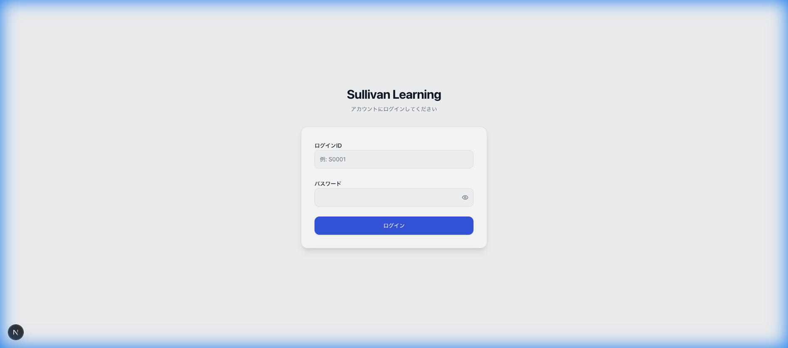
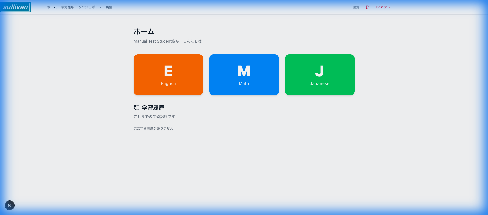
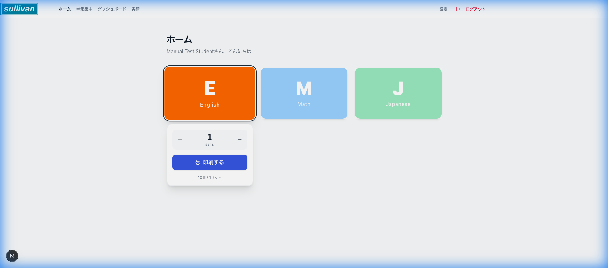
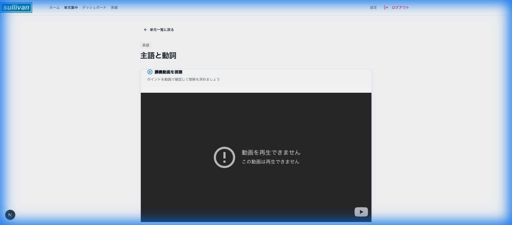
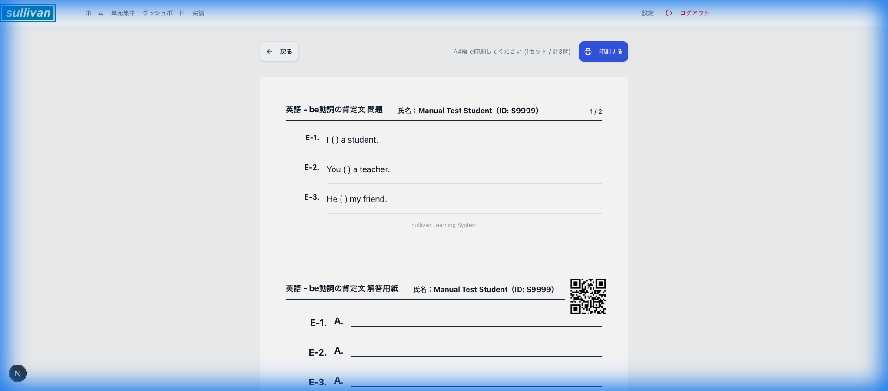
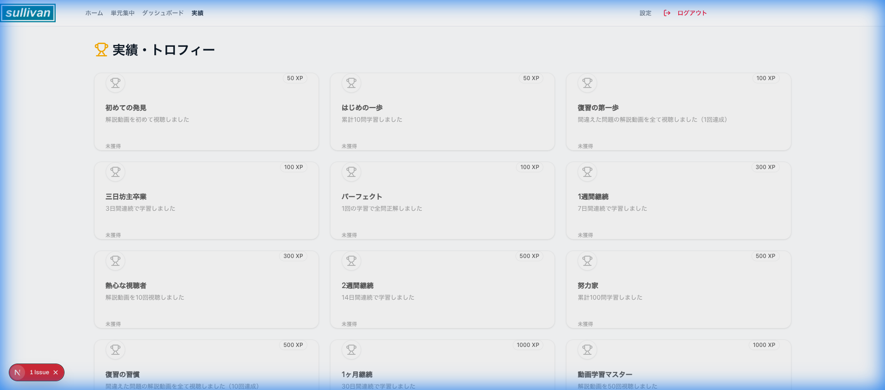

# 生徒用操作マニュアル

このマニュアルでは、生徒用アプリケーションの基本的な使い方について説明します。

## 1. ログイン

指定されたIDとパスワードを使用してログインします。

1. **ユーザーID**を入力します。
2. **パスワード**を入力します。
3. **「ログイン」**ボタンをクリックします。

※ 初回ログイン時はパスワードの変更が求められる場合があります。

## 2. ダッシュボード（ホーム画面）

ログイン後に表示されるホーム画面です。ここでは以下のことができます。

- **科目の選択**: 「英語」「数学」「国語」などの科目カードをクリックして学習を開始します。
- **実績の確認**: 画面右上のアイコンや実績メニューから、獲得したトロフィーやランクを確認できます。

## 3. 単元の選択と学習

科目を選択すると、単元（学習項目）の一覧が表示されます。

学習したい単元をクリックして、詳細画面へ進みます。

## 4. 講義動画の視聴

単元詳細画面では、解説動画を視聴して学習のポイントを確認できます。
※ 動画が設定されている単元でのみ表示されます。

動画の再生ボタンを押して視聴を開始してください。

## 5. 問題演習

「問題を印刷する」ボタンをクリックすると、問題用紙と解答用紙が表示されます。これを印刷して学習に使用してください。
※ 印刷画面が表示されます。

## 6. 実績とモチベーション

学習を進めると、様々な「実績」が解除されます。継続的な学習の励みにしましょう。

