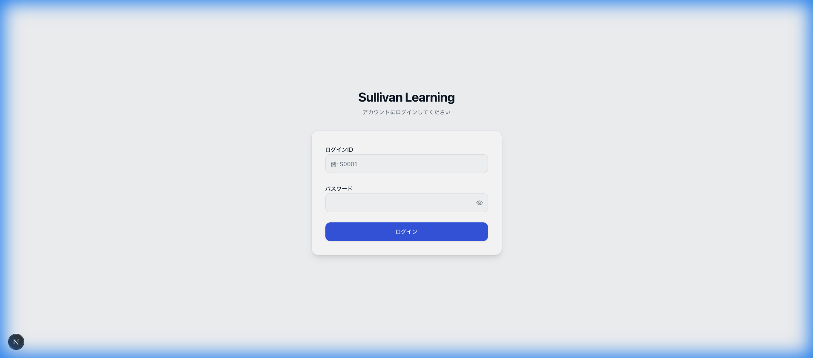
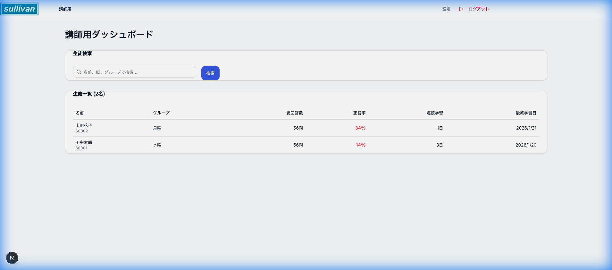
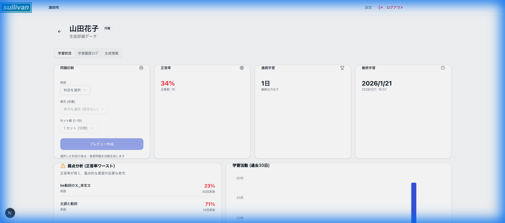
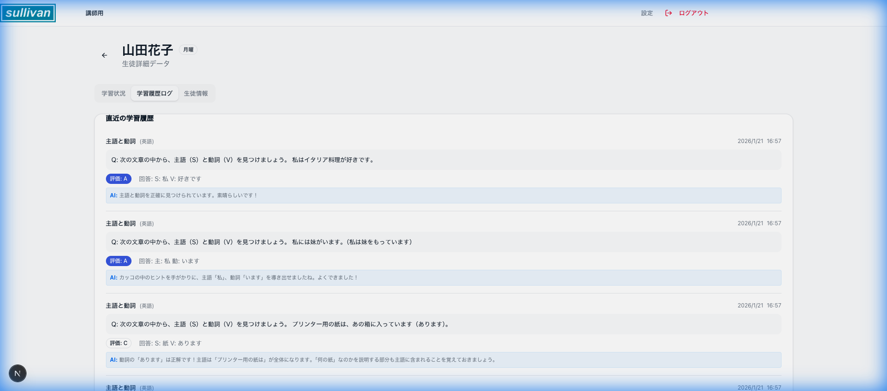
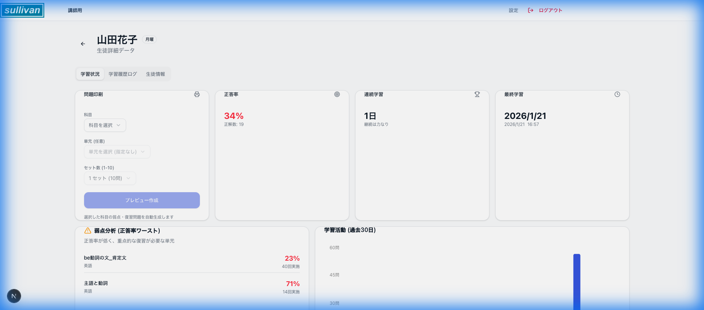
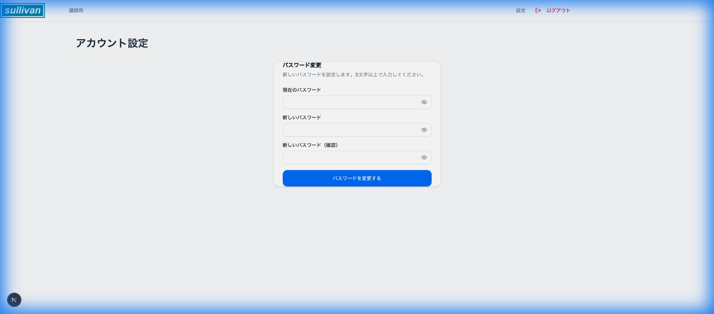

# 講師用ウェブアプリ 操作マニュアル（構成案）

本ドキュメントは、講師用アプリケーションの操作方法と、各画面の概要をまとめたマニュアル構成案です。

---

## 1. ログイン

システムを利用開始するためのログイン手順です。

1.  **ログインID**を入力します（例: `T0001`）。
2.  **パスワード**を入力します。
3.  **「ログイン」**ボタンをクリックします。

---

## 2. 教師用ダッシュボード

ログイン直後に表示されるホーム画面です。担当生徒の状況が一目で確認できます。

- **生徒一覧**: 担当している生徒のリストが表示されます。
- **クイックアクセス**: 生徒の詳細ページへ素早く移動できます。

---

## 3. 生徒一覧・検索

生徒の情報を管理、閲覧するための機能です。

- **検索機能**: 名前やIDで生徒を検索できます。
- **生徒選択**: 一覧から生徒名をクリックすると、詳細画面へ移動します。

---

## 4. 生徒詳細・プログレス

個別の生徒の学習進捗や詳細情報を確認する画面です。

- **学習進捗**: 完了した単元や、現在の学習状況（連続学習日数など）が確認できます。
- **詳細メニュー**: 「指導記録」や「問題作成」などのアクションへここからアクセスします。

---

## 5. 指導記録 (Guidance)

生徒に対する指導の履歴を確認・記録します。

- **履歴一覧**: 過去の面談や指導のログが表示されます。
- **新規記録**: 必要に応じて新しい指導記録を追加します（実装状況による）。

---

## 6. プリント作成 (Print Creation)

生徒に合わせたカスタマイズプリントを作成・印刷する機能です。

- **条件設定**: 単元や難易度などを選択して、問題を自動選出します。
- **印刷プレビュー**: 生成されたプリントを確認し、印刷またはPDF保存を行います。

---

## 7. 設定

アカウント情報の確認や設定変更を行います。

- **パスワード変更**: ログインパスワードの変更などが可能です。
